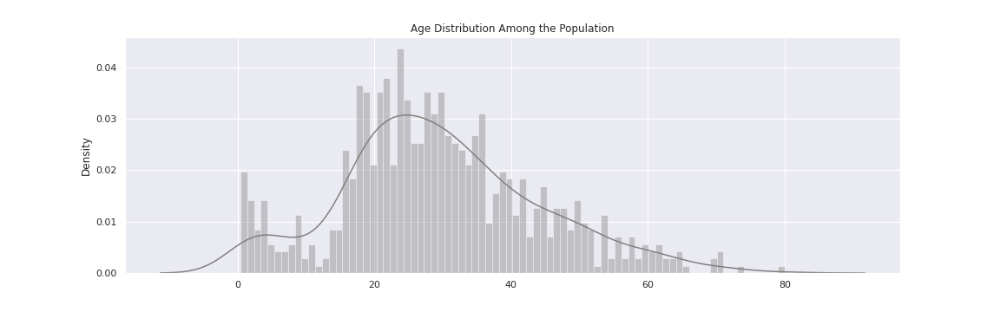
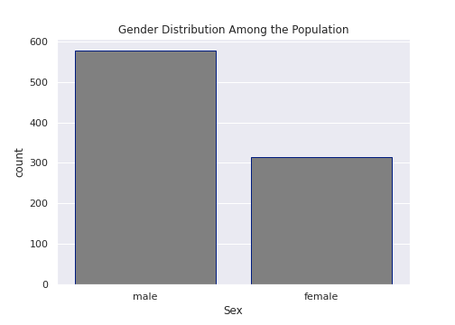
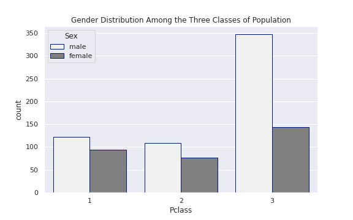
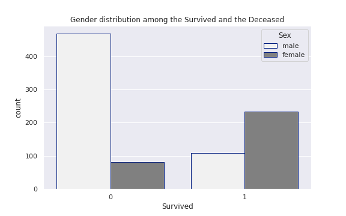
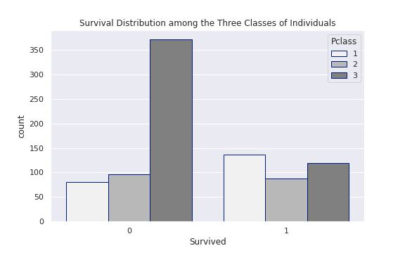
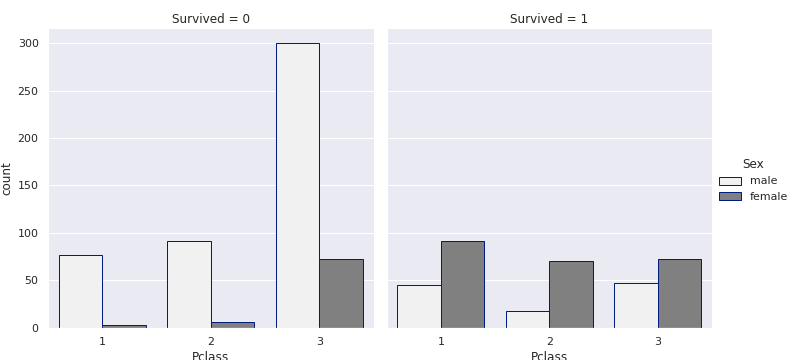
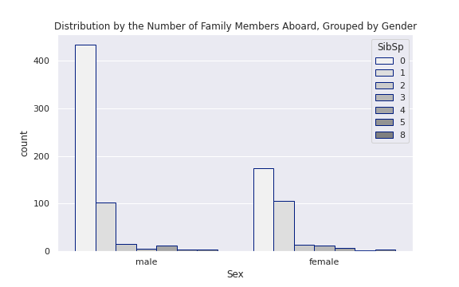
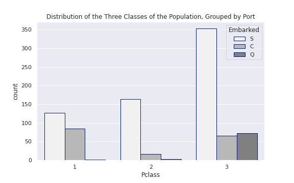

# Titanic

1. [Importar librerías](#schema1)
2. [Cargar los datos y analizar los datos](#schema2)
3. [Visualización de edades usando Matplotlib](#schema3)
4. [Visualización del sexo con Matplotlib](#schema4)
5. [Distribución de género entre las tres clases](#schema5)
6. [Distribución de género entre sobrevivientes y fallecidos](#schema6)
7. [Distribución de supervivencia entre las tres clases ](#schema7)
8. [Trazar la supervivencia de la población con respecto a su género y clase](#schema8)
9. [Distribución de la población con diferente número de miembros de la familia a bordo agrupados por género](#schema9)
10. [Visualización del puerto por el que subieron a bordo las tres clases de población.](#schema10)
11. [Preprocesamiento](#schema11)
12. [Codificación One-Hot en datos categóricos.](#schema12)
13. [Model Training](#schema13)
14. [Model Test](#schema14)
15. [Survived](#schema15)

# 1. Importar librerías

~~~python

import pandas as pd
import matplotlib.pyplot as plt
import seaborn as sns
from sklearn import metrics

from sklearn.ensemble import RandomForestClassifier
~~~

# 2. Cargar los datos y analizar los datos

~~~python

train = pd.read_csv('./data/train.csv')
train.isna().sum()

PassengerId      0
Survived         0
Pclass           0
Name             0
Sex              0
Age            177
SibSp            0
Parch            0
Ticket           0
Fare             0
Cabin          687
Embarked         2
dtype: int64

train.shape
(891, 12)

train.info()
class 'pandas.core.frame.DataFrame'>
RangeIndex: 891 entries, 0 to 890
Data columns (total 12 columns):
 #   Column       Non-Null Count  Dtype  
---  ------       --------------  -----  
 0   PassengerId  891 non-null    int64  
 1   Survived     891 non-null    int64  
 2   Pclass       891 non-null    int64  
 3   Name         891 non-null    object 
 4   Sex          891 non-null    object 
 5   Age          714 non-null    float64
 6   SibSp        891 non-null    int64  
 7   Parch        891 non-null    int64  
 8   Ticket       891 non-null    object 
 9   Fare         891 non-null    float64
 10  Cabin        204 non-null    object 
 11  Embarked     889 non-null    object 
dtypes: float64(2), int64(5), object(5)
memory usage: 83.7+ KB

test = pd.read_csv('./data/test.csv')
test.info()
<class 'pandas.core.frame.DataFrame'>
RangeIndex: 418 entries, 0 to 417
Data columns (total 11 columns):
 #   Column       Non-Null Count  Dtype  
---  ------       --------------  -----  
 0   PassengerId  418 non-null    int64  
 1   Pclass       418 non-null    int64  
 2   Name         418 non-null    object 
 3   Sex          418 non-null    object 
 4   Age          332 non-null    float64
 5   SibSp        418 non-null    int64  
 6   Parch        418 non-null    int64  
 7   Ticket       418 non-null    object 
 8   Fare         417 non-null    float64
 9   Cabin        91 non-null     object 
 10  Embarked     418 non-null    object 
dtypes: float64(2), int64(4), object(5)
memory usage: 36.0+ KB
~~~

# 3. Visualización de edades usando Matplotlib

~~~python
ages = train['Age'].dropna().tolist()
plt.figure(figsize=(16,5))
plt.hist(ages, histtype = 'bar', color = 'gray', 
         bins=50, density=True)
plt.xlabel('Age Groups')
plt.ylabel('Percentage of the Population')
plt.title('Age Distribution Among the Population')
plt.grid(True)
plt.show()
~~~

# 4. Visualización del sexo con Matplotlib

~~~python
sex = train['Sex'].dropna().tolist()
plt.figure(figsize=(7,5))
plt.hist(sex, histtype = 'bar', color = 'gray', bins=2, density=True)
plt.xlabel('Male vs Female')
plt.ylabel('Percentage of the Population')
plt.title('Gender Distribution Among the Population')
plt.grid(True)
plt.show()

~~~

# 5. Distribución de género entre las tres clases
~~~python
sns.set(style="darkgrid")
sns.set(rc={'figure.figsize':(8,5)})

sns.countplot(x="Pclass", hue="Sex", 
              data = train, color = 'gray', 
              edgecolor=sns.color_palette("dark", 1)
             ).set_title('Gender Distribution Among the Three Classes of Population')
plt.savefig("./images/sex_classes.png")
~~~

# 6. Distribución de género entre sobrevivientes y fallecidos

~~~python
sns.set(style="darkgrid")
sns.set(rc={'figure.figsize':(8,5)})

sns.countplot(x="Survived", hue="Sex", 
              data = train, color = 'gray', 
              edgecolor=sns.color_palette("dark", 1)
             ).set_title('Gender distribution among the Survived and the Deceased')
plt.savefig("./images/sex_surivived.png")
~~~

# 7. Distribución de supervivencia entre las tres clases 

~~~python
sns.set(style="darkgrid")
sns.set(rc={'figure.figsize':(8,5)})

sns.countplot(x="Survived", hue="Pclass", 
              data = train, color = 'gray', 
              edgecolor=sns.color_palette("dark", 1)
             ).set_title('Survival Distribution among the Three Classes of Individuals')
plt.savefig("./images/classes_surivived.png")
~~~

# 8. Trazar la supervivencia de la población con respecto a su género y clase

~~~python
sns.set(style="darkgrid")
sns.set(rc={'figure.figsize':(12,5)})

sns.catplot(x="Pclass", hue="Sex", col="Survived", 
            data=train, kind="count", color = 'gray', 
            edgecolor=sns.color_palette("dark", 1))
plt.savefig("./images/classes_sex_surivived.png")
~~~

# 9. # Distribución de la población con diferente número de miembros de la familia a bordo agrupados por género

~~~python
SibSp = train['SibSp'].dropna().tolist()

sns.set(style="darkgrid")
sns.set(rc={'figure.figsize':(8,5)})

sns.countplot(x="Sex", hue="SibSp", data = train, color = 'gray', 
              edgecolor=sns.color_palette("dark", 1)
             ).set_title('Distribution by the Number of Family Members Aboard, Grouped by Gender')
plt.savefig("./images/sibsp_gender.png")
~~~

# 10. Visualización del puerto por el que subieron a bordo las tres clases de población.

~~~python
sns.set(style="darkgrid")
sns.set(rc={'figure.figsize':(8,5)})

sns.countplot(x="Pclass", hue="Embarked", data = train, color = 'gray', 
              edgecolor=sns.color_palette("dark", 1)
             ).set_title('Distribution of the Three Classes of the Population, Grouped by Port')
plt.savefig("./images/port_gender.png")
~~~

# 11. Preprocesamiento
~~~python
train.columns.values
array(['PassengerId', 'Survived', 'Pclass', 'Name', 'Sex', 'Age', 'SibSp',
       'Parch', 'Ticket', 'Fare', 'Cabin', 'Embarked'], dtype=object)
~~~

##  Obtener el título
~~~python
titles = ['Mrs', 'Mr', 'Don', 'Jonkheer', 'Master', 'Miss', 'Major', 
          'Rev', 'Dr', 'Ms', 'Mlle','Col', 'Capt', 'Mme', 'Countess']

def get_title(name):
    for title in titles:
        if title in name:
            return title
    return 'None'

train['Title'] = train['Name'].apply(lambda x: get_title(x))
~~~

## Rellenar con la media de las edas las edades nulas
~~~python
train['Age'].mean()
29.69911764705882
train['Age'].fillna(train['Age'].mean(), inplace = True)
~~~

## Eliminar las columnas `Cabin`
~~~python
train.drop('Cabin', axis = 1, inplace = True)
train.isna().sum()

PassengerId    0
Survived       0
Pclass         0
Name           0
Sex            0
Age            0
SibSp          0
Parch          0
Ticket         0
Fare           0
Embarked       2
Title          0
dtype: int64
~~~
Como hemos rellenado las edades con la media y elimando la columna  `Cabin` que no la íbamos a usar. Comprobamos los nulos y los eliminamos
~~~python
train.dropna(inplace = True)
~~~

## Separamos los valores train y test
~~~python
x_train = train[['Pclass', 'Sex', 'Age', 'SibSp', 'Parch', 'Fare', 'Embarked', 'Title']]
y_train = train['Survived']
~~~

# 12. Codificación One-Hot en datos categóricos.

~~~python
x_train = pd.get_dummies(x_train)
x_train.info()
<class 'pandas.core.frame.DataFrame'>
Int64Index: 889 entries, 0 to 890
Data columns (total 25 columns):
 #   Column          Non-Null Count  Dtype  
---  ------          --------------  -----  
 0   Pclass          889 non-null    int64  
 1   Age             889 non-null    float64
 2   SibSp           889 non-null    int64  
 3   Parch           889 non-null    int64  
 4   Fare            889 non-null    float64
 5   Sex_female      889 non-null    uint8  
 6   Sex_male        889 non-null    uint8  
 7   Embarked_C      889 non-null    uint8  
 8   Embarked_Q      889 non-null    uint8  
 9   Embarked_S      889 non-null    uint8  
 10  Title_Capt      889 non-null    uint8  
 11  Title_Col       889 non-null    uint8  
 12  Title_Countess  889 non-null    uint8  
 13  Title_Don       889 non-null    uint8  
 14  Title_Dr        889 non-null    uint8  
 15  Title_Jonkheer  889 non-null    uint8  
 16  Title_Major     889 non-null    uint8  
 17  Title_Master    889 non-null    uint8  
 18  Title_Miss      889 non-null    uint8  
 19  Title_Mlle      889 non-null    uint8  
 20  Title_Mme       889 non-null    uint8  
 21  Title_Mr        889 non-null    uint8  
 22  Title_Mrs       889 non-null    uint8  
 23  Title_Ms        889 non-null    uint8  
 24  Title_Rev       889 non-null    uint8  
dtypes: float64(2), int64(3), uint8(20)
memory usage: 59.0 KB
~~~

# 13. Model Training

~~~python
# Inicializamos el modelo
clf = RandomForestClassifier(max_depth=75, random_state=0)
# Entrenamos el modelo
clf.fit(x_train, y_train)
~~~

# 14. Model Test
Aplicamos todos los cambio al dataset de test
~~~python
test['Title'] = test['Name'].apply(lambda x: get_title(x))
test['Age'].fillna(test['Age'].mean(), inplace = True)
test.drop('Cabin', axis = 1, inplace = True)
test['Fare'].fillna(test['Fare'].mean(), inplace = True)
x_test = test[['Pclass', 'Sex', 'Age', 'SibSp', 'Parch', 'Fare', 'Embarked', 'Title']]
x_test = pd.get_dummies(x_test)
~~~

# 15. Survived

~~~python
Survived = clf.predict(x_test)
array([0, 0, 0, 0, 1, 0, 0, 0, 1, 0, 0, 0, 1, 0, 1, 1, 0, 1, 0, 1, 1, 1,
       1, 1, 1, 0, 1, 1, 0, 0, 0, 0, 1, 0, 1, 1, 0, 0, 0, 0, 0, 0, 0, 1,
       1, 0, 0, 0, 1, 1, 0, 0, 1, 1, 0, 0, 0, 0, 0, 1, 0, 0, 0, 1, 0, 1,
       1, 0, 0, 1, 1, 0, 0, 0, 1, 0, 0, 1, 0, 1, 1, 0, 0, 0, 0, 0, 1, 0,
       0, 1, 0, 0, 1, 0, 0, 0, 1, 0, 0, 0, 1, 0, 0, 0, 1, 0, 0, 0, 0, 0,
       0, 1, 1, 1, 1, 0, 0, 1, 1, 1, 1, 0, 1, 0, 0, 1, 0, 1, 0, 0, 0, 0,
       0, 0, 0, 0, 0, 0, 0, 0, 0, 1, 0, 0, 0, 0, 0, 0, 0, 1, 1, 0, 0, 1,
       0, 0, 1, 0, 0, 1, 1, 1, 1, 0, 1, 1, 0, 0, 1, 0, 0, 0, 0, 0, 0, 1,
       1, 1, 1, 1, 0, 1, 1, 0, 1, 0, 1, 0, 0, 0, 0, 0, 0, 0, 0, 0, 1, 0,
       0, 0, 1, 1, 1, 1, 0, 0, 1, 0, 1, 0, 0, 0, 0, 1, 0, 0, 1, 0, 1, 0,
       1, 0, 1, 0, 1, 0, 0, 0, 0, 0, 0, 1, 0, 0, 1, 0, 1, 1, 1, 1, 1, 1,
       0, 0, 0, 0, 1, 0, 1, 0, 1, 0, 0, 0, 0, 0, 0, 0, 1, 0, 0, 0, 1, 1,
       0, 0, 0, 0, 0, 0, 0, 0, 1, 1, 0, 1, 0, 0, 0, 0, 0, 1, 0, 0, 1, 0,
       0, 0, 0, 0, 0, 0, 0, 0, 0, 0, 1, 0, 0, 0, 0, 0, 0, 0, 0, 1, 1, 1,
       0, 0, 0, 1, 0, 1, 1, 1, 1, 0, 0, 0, 0, 0, 0, 0, 1, 0, 1, 0, 0, 0,
       1, 0, 0, 1, 0, 0, 0, 0, 0, 0, 0, 0, 0, 1, 0, 1, 0, 1, 0, 1, 1, 0,
       0, 0, 1, 0, 1, 0, 0, 1, 0, 1, 1, 0, 1, 0, 0, 0, 1, 0, 0, 1, 0, 0,
       1, 1, 0, 0, 0, 0, 0, 0, 1, 1, 0, 1, 0, 0, 0, 0, 0, 1, 0, 0, 0, 1,
       0, 1, 0, 0, 1, 0, 1, 0, 0, 0, 0, 0, 1, 1, 0, 1, 0, 0, 1, 0, 0, 0])
~~~

# Documentación
https://towardsdatascience.com/what-is-one-hot-encoding-and-how-to-use-pandas-get-dummies-function-922eb9bd4970

https://www.kaggle.com/c/titanic